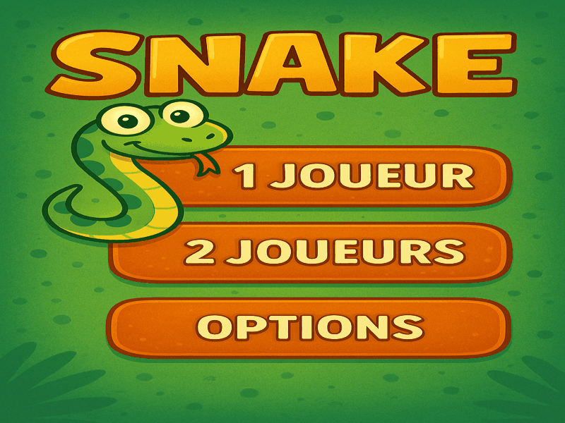

# 🐍 Snake - Projet Python L1
Ce projet est une version améliorée du célèbre jeu **Snake**, développée en Python dans le cadre d’un TP à l’université (L1).
Il intègre plusieurs **modes de jeu**, des **options activables**, ainsi qu’un **mode deux joueurs** !

---
## Aperçu du jeu 
  

---

## Fonctionnalités
- Mode 1 joueur et 2 joueurs
- Option **obstacles** : évite les blocs sur la carte !
- Option **accélération** : la vitesse du jeu augmente au fur et à mesure
- Option **Pacman** : traverse les bords et ressors de l’autre côté 🌀
- Système de **score** et affichage dynamique
- Graphismes personnalisés (fond, menu, game over…)

---

## Contrôles

| Joueur 1        | Joueur 2   |
| --------------  | ---------- |
| Flèches ↑ ↓ ← → | Z Q S A    |
| ESC             | Quitter    |

---

## Installation

1. Clone ce dépôt :

```bash
git clone https://github.com/tonusername/snake_python.git
cd snake_python
```

2. Lance simplement le fichier Python (pas besoin de `pip install`, le projet utilise `fltk.py` fourni dans le dossier) :

```bash
python snake.py
```
---

## Structure du projet
```
/assets             # Images (fond, grille, menus, game over...)
/src                # fltk.py
snake.py            #Le code source 
README.md           # Le fichier que vous lisez actuellement
```

---

## Prérequis
- Python 3.x
- Le fichier `fltk.py` (fourni dans le projet)
---

## 💡 Contribution
Les contributions sont les bienvenues !  
Si vous avez des idées d’amélioration, n’hésitez pas à ouvrir une issue ou proposer une pull request.

---
## Licence

Projet développé dans le cadre d’un TP Python à l’université.  
Utilisation libre dans un but pédagogique ou personnel.

